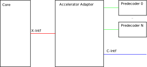
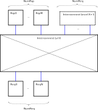

# Flexible Accelerator Infrastructure

The Flexible Accelerator Infrastructure (FAI) defines a unified framework for RISC-V CPU cores to implement ISA extensions in external functional units and to share accelerator structures among multiple cores.

## Background
The different RISC-V cores originally designed and used at IIS (CV32E40P, CVA6, Ibex, Snitch) all feature various, and configurable extensions over the baseline RV32I/RV64I ISA.
Examples include support for the custom Xpulp ISA extensions, standard extensions like B (Bitmanip), M (Integer Multiplication and Division), F (Single-Precision Floating Point), D (Double-Precision Floating Point).
The integration of these various instructions into the pipeline varies a lot.
Some ISA extensions (Xpulp, B, M) are deeply integrated into the core pipeline which complicates verification, debugging, and reduces portability to other designs.
In contrast, some designs implement the F and D extensions outside of the core pipeline (CV32E40P, Snitch) and use a variety of interfaces and interconnects.

The goal of the FAI is to reduce the overall divergence between the different cores and provide a generalized infrastructure suitable to implement custom co-processors and ISA extensions.

## Overview
The FAI aims to provide an entirely accelerator-agnostic instruction offloading mechanism.
The core concept of the FAI is to move as much logic required to implement an ISA extension outside to offloading CPU cores.
No extension-specific changes should be necessary to a CPU core architecture supporting the FAI in order to implement new custom extensions.

The FAI comprises the following core components
- The [accelerator interconnect module](accelerator-interconnect.md) implements the signal routing from CPU core to accelerator unit through the accelerator interconnect interface [(C-Interface)](c-interface.md).
- The [accelerator adapter module](accelerator-adapter.md) implements the infrastructure necessary for accelerator-agnostic instruction offloading from the CPU core to the accelerator interconnect through the accelerator-agnostic offloading interface [(X-Interface)](x-interface.md).
- The [accelerator predecoder module](accelerator-predecoder.md) is instantiated for each implemented extension and implements decoding of instruction-specific metadata.

## Properties

### Accelerator-Agnostic Instruction Offloading
The FAI enables decoupled development of accelerators and CPU cores through a mechanism facilitating accelerator-agnostic instruction offloading.

### Pseudo Dual-Issue
The FAI allows for the offloading CPU core to continue execution of instructions in parallel to the accelerator operation.

### Dual-Writeback Instructions
The FAI supports implementation of custom ISA extensions mandating dual register writebacks.
In order to accomodate that need we provision the possibility to reserve multiple destination registers for a single offloaded instruction.
For even destination registers other than `X0`,  `Xn` and `Xn+1` are reserved for write-back upon offloading a dual write-back instruction, where `Xn` denotes the destination register addresss extracted from `instr_data[11:7]`.

### Hierarchical Interconnect
The accelerator interface is designed to enable a number of flexible topologies.
The simplest topology is the direct attachment of one or multiple accelerator to a single CPU core.
The interconnect also supports sharing of accelerators accross multiple accelerators accross multiple cores in a cluster-like topology.
The sharing granularity of accelerators is flexible.
Any number of cores in a cluster can be connected to share a selection of accelerators resulting in a hierarchical interconnect.

### Multiple Accelerators of the Same Type (TODO)
The depicted interconnect schematic relies upon the [stream\_xbar](https://github.com/pulp-platform/common_cells/blob/master/src/stream_xbar.sv) IP to facilitate routing of requests and responses from and to the accelerator structures.
One limitation of using this IP is that it is not possible to utilize multiple accelerators of the same type at the same accelerator address.
This issue will be relieved by implementing a variant of the IP which uses a N:K streaming arbiter in the output path of the stream\_xbar.
An according IP exists in the [APU Cluster](https://github.com/pulp-platform/apu_cluster/tree/master/sourcecode/marx).

## Architecture

### Accelerator Adapter Module
The accelerator adapter module facilitates accelerator-agnostic instruction offloading to the accelerator interconnect.
The core-side connection implements the instruction offloading [X-interface](x-interface.md).
The accelerator adapter connects to the interconnect through the [C-interface](c-interface.md).
In addition, the adapter module connects to a collection of accelerator-specific predecoder modules.

### Accelerator Interconnect module
The [accelerator interconnect module](../rtl/acc_interconnect) implements the interconnect fabric on each level of the interconnect hierarchy.
It comprises a crossbar for routing of requests and responses from a number of requesting units the accelerator structures residing on the corresponding interconnect level, as well as a bypass-path to forward requests from and to a higher hierarchy level.
All in- and output ports implement the [C-interface](c-interface.md).
For request and response path, separate pipeline registers may be implemented for each interconnect module.

## Requirements

### CPU Support
In order to continue normal operation during the execution of offloaded instructions, the core must maintain a scoreboard to keep track of outstanding accelerator write-backs.
In order to support accelerators implementing dual write-back instructions, the offloading core must include provisions to reserve two destination registers upon offloading an instruction as well as simultaneous writeback, implying dual write-ports to the internal register file.
To enable accelerator-agnostic instruction offloading, a CPU core architecture must implement the X-interface defined [here](x-interface.md).
Connection to the accelerator interconnect is facilitated through the accelerator adapter module.
Alternatively, a CPU core may implement all necessary predecoding internally, implement the [C-interface](c-interface.md) and directly connect to the accelerator interconnect.

### Accelerator Support
The external accelerator unit must implement the C-interface defined [here](c-interface.md).
The accelerator unit must implement an instruction decoder for control of the accelerated data path.
In case of state-dependent ISA extensions (dedicated register files, control and status registers), the accelerator must locally implement the required structures.
For units shared among multiple cores, the accelerator must provide a means to separately maintain the status of each connected core.

## Open Questions

### Memory Consistency
In the event of offloaded memory access instructions, there is currently no way to guarantee the order in which the operations are executed.
At the moment, no ultimate solution exists in our design.
The fact that outstanding register file writebacks can be detected in the scoreboard of the offloading core provides some measure of control.
However, it is not guaranteed that the accelerator will not make memory requests that do not impact the integer register file.
To handle this case, we could implement a memory fence instruction, which would need to be sent to each accelerator that is capable of accessing memory.

For more information, ideas and contributions to the subject, please refer to the corresponding [issue](https://github.com/ganoam/accelerator-interface/issues/2).

### Error Response
The interconnect response channel carries an error flag signal.
However, the action to be taken by an offloading core upon encounering an accelerator error condition has not yet been defined.
