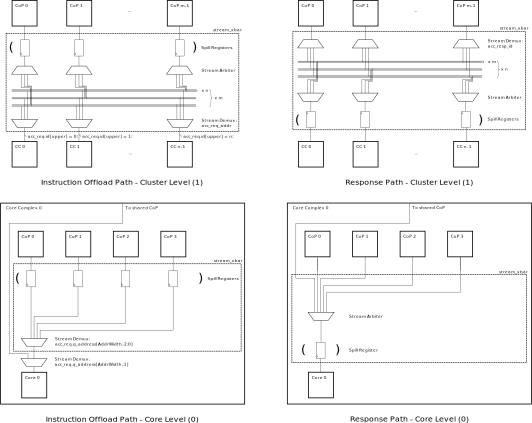

# Accelerator Interface

The `accelerator_interface` is a portable interface for RISC-V CPU cores to communicate with external functional units.
The interface provides a unified way to implement custom ISA extensions in external accelerator structures and to share accelerator units among multiple cores.
The design concurrently supports core-private and shared functional units.
It implements two independent decoupled channels (request and response) which are handshaked according to the following scheme:

  - The initiator asserts `valid`. The assertion of `valid` must not depend on `ready`. The assertion of `ready` may depend on `valid`.
  - Once `valid` has been asserted all data must remain stable.
  - The receiver asserts `ready` whenever it is ready to receive the transaction. Asserting `ready` by default is allowed. While `valid` is low, `ready` may be retracted at any time.
  - When both `valid` and `ready` are high the transaction is successful.

## Parameters
The interface is compatible with 32, 64 and 128-bit RISC-V ISA variants.
It is designed to work with a configurable number of requesters and (shared) responders.
The according configuration parameters are:

| Name               | Type / Range                                     | Default | Description                                |
| ------------------ | ------------------------------------------------ | ------- | ------------------------------------------ |
| `NumReq`           | `int` (>= 1)                                   | 1       | Number of requesting entities              |
| `NumRespPriv`      | `int` (0, ...)                                   | 1       | Number of core-private responding entities |
| `NumRespShared`    | `int` (0, ...)                                   | 1       | Number of shared responding entities       |
| `AccAddrWidth`     | `int` clog2(max(NumRespPriv, NumRespShared)) + 1 |         | Accelerator Address                        |
| `DataWidth`        | `int` (32, 64, 128)                              | 32      | ISA Bit Width                              |

## Channels

### Request Channel (`q`)

An offload request comprises the entire 32-bit RISC-V instruction three operands and a request ID tag specifying requesting entity.
The nature of the offloaded instructions is not of importance to the accelerator interconnect.
The request channel interface signals are:

| Signal Name   | Range                   | Description                          |
| ------------- | ----------------------- | ------------------------------------ |
| `q_addr`      | `AccAddrWidth`          | Accelerator Sharing Level            |
|               | `AccAddrWidth-1:0`      | Accelerator Address                  |
| `q_id`        | `5 + clog2(NumReq)-1:5` | Requester ID                         |
|               | `4:0`                   | Destination Register Address         |
| `q_data_op`   | `31:0`                  | RISC-V Instruction Data              |
| `q_data_arga` | `DataWidth-1:0`         | Operand A                            |
| `q_data_argb` | `DataWidth-1:0`         | Operand B                            |
| `q_data_argc` | `DataWidth-1:0`         | Operand C                            |

Notes:
  - The *Requester ID* field of the signal `q_id` is assigned during traversal of the request path.
    The *destination register address* is determined by the offloading core.

### Response Channel (`p`)
*Not* every operation which was offloaded must ultimately return a response.
If a response is returned, the response channel carries the following signals:

| Signal Name   | Range                   | Description                          |
| ------------- | ----------------------- | ------------------------------------ |
| `p_id`        | `5 + clog2(NumReq)-1:5` | Requester ID                         |
|               | `4:0`                   | Destination Register Address         |
| `p_data`      | `DataWidth-1:0`         | Operation Result                     |
| `p_error`     | `0:0`                   | Error Flag                           |

## Core Support
In order to make use of the accelerator interface, a compliant core must
  - Generate accelerator interface signals.
    - On the core level the *q_id* signal comprises only the destination register address.
      The *Requester ID* is appended to the MSB range of the signal depending on the location of the core within the cluster.
  - Handle handshaking with the accelerator interconnect.
  - Maintain a scoreboard to keep track of outstanding accelerator write-backs.
    The core can continue normal operation during accelerator operation unless a source register reserved by an offloaded instruction is used.
  - The core must wait for any outstanding write-backs before entering sleep mode in case of a wait for interrupt (`wfi`) instruction.

### Operand Origin
The operands forwarded to the accelerator interconnect are determined in the same way as any regular RISC-V instructions.
Any source registers from the integer register file of the offloading core and encoded immediate values as defined in the [RISC-V User-Level ISA specification](https://riscv.org/wp-content/uploads/2017/05/riscv-spec-v2.2.pdf#page=24) are allowed.
If source registers are used, operand A, B and C contain `rs1`, `rs2` and `rs3` respectively.
For ternary instructions, the instruction format R4-type instruction format is to be used, defining the `rs3` register address by bits `instr_data[31:27]`.

### Write-back Destination
The default writeback destination for offloaded instruction is the RISC-V destination register specified by `instr_data[11:7]`.

### Dual-Writeback Instructions
This section of the specification provides *preliminary* information.
The contents are subject to discussion and may change anytime.

Custom ISA extensions may mandate dual-register writebacks.
In order to accomodate that need we may provision the possibility to reserve multiple destination registers for a single offloaded instruction.
For even destination registers other than `X0`,  `Xn` and `Xn+1` are reserved for write-back upon offloading an instruction, where `Xn` denotes the destination register addresss extracted from `instr_data[11:7]`.

#### Implications on the Interconnect
In order to maximize benefits from dual-writeback instructions, the interconnect response path must be adapted to accomodate simultaneous transfer of two operation results.
The modified response interface supports the following signals.

| Signal Name   | Range                   | Description                          |
| ------------- | ----------------------- | ------------------------------------ |
| `p_id`        | `5 + clog2(NumReq)-1:5` | Requester ID                         |
|               | `4:0`                   | Destination Register Address         |
| `p_data0`     | `DataWidth-1:0`         | Primary Writeback Data               |
| `p_data1`     | `DataWidth-1:0`         | Secondary Writeback Data             |
| `p_dualwb`    | `0:0`                   | Dual-Writeback Response.             |
| `p_error`     | `0:0`                   | Error Flag                           |

For responses resulting from dual-writeback instructions, the accelerator asserts `p_dualwb`.
Upon accepting the accelerator response, the offloading core writes back data contained in `p_data0` to register `p_id[4:0]`.
`p_data1` is written back to `p_id[4:0]` + 1.

#### Implications on Core implementation
The offloading core must include provisions to reserve two destination registers upon offloading an instruction.
For maximum benefits, the core should include provisions for simultaneous writeback, implying dual write-ports to the internal register file.

## Accelerator Support
In order to accept instructions off the accelerator interface, an accelerator subsystem must decode the RISC-V instruction data and generate the specific control signals for communication with the accelerator.
For instructions mandating writeback to the core, the request ID must be returned together with the according response packet.

## Interconnect Layout
The accelerator interconnect supposts external accelerators aranged in two levels.
The level of an accelerator to which an offload instruction is adressed is determined by the most significant bit of the accelerator address field of the request channel (0=private, 1=shared).

A schematic of the accelerator interconnect is shown below.

### Multiple Accelerators of the Same Type
The depicted interconnect schematic makes extensive use of the [stream\_xbar](https://github.com/pulp-platform/common_cells/blob/master/src/stream_xbar.sv) IP to facilitate routing of requests and responses from and to the accelerator structures.
One limitation of using this IP is that it is not possible to utilize multiple accelerators of the same type at the same accelerator address.
This issue could be relieved by implementing a variant of the IP which uses a N:K streaming arbiter in the output path of the stream\_xbar.
An according IP exists in the [APU Cluster](https://github.com/pulp-platform/apu_cluster/tree/master/sourcecode/marx).

## Open Questions

### Memory Consistency
In the event of offloaded memory access instructions, there is currently no way to guarantee the order in which the operations are executed.
At the moment, no ultimate solution exists in our design.
The fact that outstanding register file writebacks can be detected in the scoreboard of the offloading core provides some measure of control.
However, it is not guaranteed that the accelerator will not make memory requests that do not impact the integer register file.
To handle this case, we could implement a memory fence instruction, which would need to be sent to each accelerator that is capable of accessing memory.

For more information, ideas and contributions to the subject, please refer to the corresponding [issue](https://github.com/ganoam/accelerator-interface/issues/2).

### External Register Files
*Tentative specification*
In case of shared accelerators relying on dedicated register files, a shared accelerator needs to maintain one private register file per sharing core.
Similarly, for status-based extensions the accelerator subsystem must separately maintain the the status of each core.

### Accelerator-Agnostic Cores
To decouple the development of accelerators and cores, it may be beneficial separate the handling of offloaded instructions from the rest of the core's operation.
An external pre-decoder structure may be implemented to facilitate this use case.

A tentative specification thereof is given [here](accelerator_agnostic_interface.md)

For more information, ideas and contributions to the subject, please refer to the corresponding [issue](https://github.com/ganoam/accelerator-interface/issues/1).

